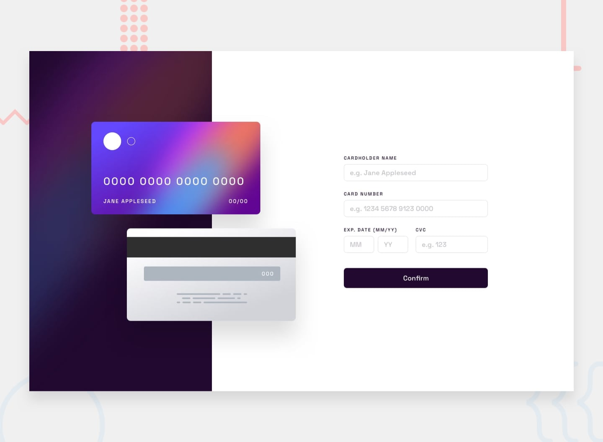

# Frontend Mentor - Interactive card details form solution

This is a solution to the [Interactive card details form challenge on Frontend Mentor](https://www.frontendmentor.io/challenges/interactive-card-details-form-XpS8cKZDWw). Frontend Mentor challenges help you improve your coding skills by building realistic projects. 

## Table of contents

- [Overview](#overview)
  - [The challenge](#the-challenge)
  - [Screenshot](#screenshot)
  - [Links](#links)
- [My process](#my-process)
  - [Built with](#built-with)
  - [What I learned](#what-i-learned)
  - [Continued development](#continued-development)
- [Author](#author)

## Overview

### The challenge

Users should be able to:

- Fill in the form and see the card details update in real-time
- Receive error messages when the form is submitted if:
  - Any input field is empty
  - The card number, expiry date, or CVC fields are in the wrong format
- View the optimal layout depending on their device's screen size
- See hover, active, and focus states for interactive elements on the page

### Screenshot



### Links

- Solution URL: [GitHub Repository](https://github.com)
- Live Site URL: [Live Site](https://github.com)

## My process

### Built with

- Semantic HTML5 markup
- CSS custom properties
- Flexbox
- Mobile-first workflow
- [Vue.js](https://vuejs.org/) - JS framework
- Vue CLI

### What I learned

Through this project, I significantly improved my understanding of Vue.js, especially involving two-way data binding and real-time form validation. Binding multiple inputs to update the visual representation of the credit card simultaneously required thoughtful state management.

```js
export default {
  data() {
    return {
      cardName: '',
      cardNumber: '',
      expMonth: '',
      expYear: '',
      cvc: ''
    }
  }
}
```

### Continued development

As I move forward with Vue, I want to increasingly focus on more advanced form validation techniques and transition animations to create smoother user experiences. Additionally, modularizing components further could improve overall code maintainability.

## Author

- Website - [Rafi Zaman](https://www.rafizaman.com)
- Frontend Mentor - [@yourusername](https://www.frontendmentor.io/profile/rafi983)
